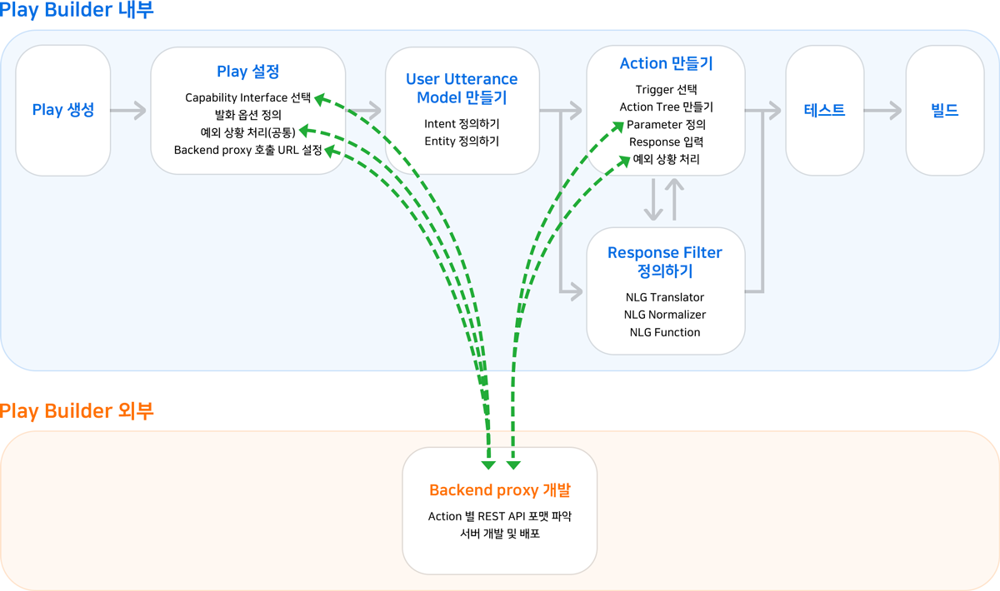

# Backend proxy 사용하여 Play 만들기

## 개요

Backend proxy는 Play Builder에서 응답을 생성하기 위해 필요한 정보를 외부 서버로부터 가져와야 하는 경우 NUGU 플랫폼에서 REST API를 통해 호출하는 서버입니다. Backend proxy


개발에 대한 자세한 내용은 [외부 연동 서버\(Backend proxy\)](use-backend-proxy/)를 참고하세요.


Backend proxy는 위 그림과 같이 다음의 경우에 사용합니다.

1. Action의 응답을 정의할 때, 외부 서버로부터 정보를 가져와야 하는 경우


날씨 상태, 지하철 도착 예정 시간, 특정 POI의 전화번호 등


1. 특정 Entity에 대하여 서버의 판단이 필요할 때


사용자가 말한 날짜가 무슨 요일인지 판단

사용자로부터 2개의 Entity를 받아서 처리해야 할 때, 2개의 Entity의 정합성을 체크하는 경우\(2월 31일의 날씨 알려줘, 일본의 뉴욕 시간 알려줘\)


1. 서버에서 연산하여 결과를 제공할 수 있는 경우


현재 시간: 2 + 3의 결과


1. Directive를 사용하여 디바이스의 기능을 동작시켜야 하는 경우


오디오 재생, 멈춤


1. 예외 상황에 대한 판단이 필요할 때


콘텐츠 서버의 장애

사용자가 지원하지 않는 범위의 정보를 요청했을 때, Intent는 유지하면서 Entity만 다시 받아 처리하고 싶은 경우



Backend Parameter, 예외 상황 관리, Capability Interface\(Directive\)와 관련한 자세한 내용은 다음 링크 페이지를 참고하세요.

* **Parameter**: [Parameter 사용하기](define-an-action/use-parameters/)
* **Capability Interface\(Directive\)**: [AudioPlayer Interface 지원하는 Play 만들기](create-a-play-with-audioplayer/)
* **예외 상황**: [예외 상황 관리](define-an-action/manage-exceptions.md)


## 개발

Backend proxy를 사용하기 위해서는 다음과 같은 순서로 진행을 해야 합니다.

1. Backend proxy 서버를 구축합니다.
   * Backend proxy 개발에 대한 자세한 내용은 [외부 연동 서버\(Backend proxy\)](use-backend-proxy/)를 참고하세요.
2. Backend proxy를 Play와 연결합니다.
   * Play Builder에서 해당 Play의 `General` &gt; `외부 서버 연결 정보` 페이지에서 Backend proxy의 Web URL을 입력합니다.
   * Web URL 입력 시 http:// 또는 https://를 포함하여 작성합니다.
   * 이 Backend proxy과의 통신이 실패했을 때 사용자에게 전달할 메시지를 '연결 실패 시 prompt'에 입력합니다.
   * Backend proxy와 Play를 연결하는 자세한 방법은 [Play 설정하기](customize-a-play.md)를 참고하세요.
3. Play 개발자는 Backend proxy 개발자와 다음 사항을 공유해야 합니다.
   * 어떤 Entity Parameter를 정의하였고, 해당 Entity Parameter는 어떠한 값들이 전달이 될 것인가를 전달해야 합니다.
   * Entity를 정규화 한다면 대표값이 Entity Parameter에 담겨서 전달이 될 것이므로 해당 대표값을 전달해야 합니다. 
   * 어떠한 Backend Parameter가 필요하고, 해당 parameter에는 어떤 값이 담기기를 기대하는지를 안내해야 합니다. 
   * Play를 만들어가면서 발생되는 예외 상황들에 대해 안내를 하고 각 상황별 code\(Exception Code\)를 요청해야 합니다. 
   * Capability Interface를 사용하는 경우 어떤 Intent에서 어떻게 Directive를 내보낼 것인지 논의합니다. 
4. Backend proxy 개발자와 논의한 바탕으로 Backend Parameter를 활용하고, 예외 상황 Prompt도 입력합니다.
   * 예외 처리에 대한 자세한 내용은 [예외  상황 관리](define-an-action/manage-exceptions.md)를 참고하세요.


이 장과 같이 보면 좋은 도움말

* [Backend proxy](use-backend-proxy/)
* [Backend Parameter](define-an-action/use-parameters/)


