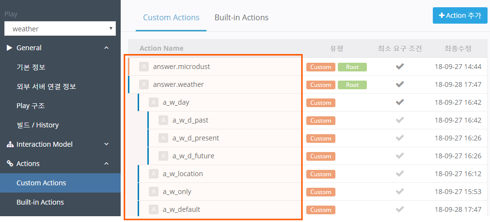
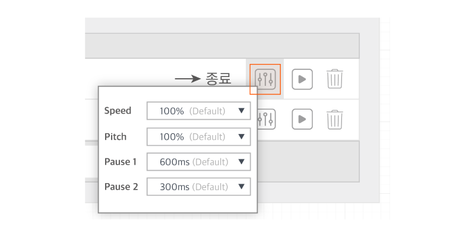

# Prompt 사용하기

## Prompt 사용하기 

Prompt는 사용자에게 응답으로 전달할 메시지를 의미합니다. Prompt를 작성할때 다음과 같은 구성 요소들을 사용할 수 있습니다.

| 구성 요소 | 하위 구성 요소 | 특징 | 자동완성 단축키 |
| :--- | :--- | :--- | :--- |
| 일반 텍스트 |  | '가나다'와 같은 일반적인 텍스트를 그대로 읽어 발화합니다. | 지원 안 함 |
| Parameter |  | {{parameter\_name}}와 같은 형태로 사용하며, Parameter에 담긴 값을 텍스트로 변형하여 발화합니다.   Parameter 사용법에 대한 자세한 내용은 [Parameter 사용하기](../use-parameters/)를 참고하세요. | {{ |
| Response Filter | NLG Translator | Parameter와 항상 결합하여 사용되며, 단독으로 쓰일 수 없습니다. | &gt; |
|  | NLG Normalizer | Parameter에 담겨 있는 값이 Filter의 Source와 100% 일치할 경우에만 동작합니다. | = |
|  | NLG Function | Response Filter에 대한 자세한 내용은 [Response Filter](../../define-response-filters.md)를 참고하세요. | : |
| 조사 |  | '을/를'과 같이 앞 음절에 따라 조사가 바뀌는 경우에 자동으로 변환하여 발화합니다.   조사 자동 변환은 Parameter와 함께 사용될 때만 동작합니다.  조사 처리에 대한 자세한 내용은 [조사 처리하기](use-prompts.md#process-postpositions)를 참고하세요. | / |
| SKML 태그 |  | TTS 엔진이 텍스트 혹은 Parameter의 값을 SKML 태그에 따라 발화합니다.   SKML 태그 사용 대한 자세한 내용은 [발화 옵션 사용하기](use-prompts.md#use-utterance-options)를 참고하세요. | &lt; |

#### Prompt의 유형 

Play Builder의 Prompt에는 3가지 유형이 있습니다.

| 유형 | 설명 |
| :--- | :--- |
| 대기 Prompt | Prompt가 발화된 이후 Play의 세션이 유지됩니다. |
| 연속 Prompt | 뒤이어 올 Prompt가 있는 경우에만 발화되며, 뒤이어 오는 Prompt와 더해져서 하나의 문장처럼 발화됩니다. |
| 종료 Prompt | Prompt가 발화된 이후 Play의 세션이 종료됩니다. |

Prompt는 사용 위치에 따라 다음과 같이 구분됩니다.

| 위치 |  | 특징 |
| :--- | :--- | :--- |
| 일반 Response의 Prompt | Welcome Action을 제외한 모든 Action | 대기 Prompt와 종료 Prompt가 사용됩니다.   여러 Prompt가 입력된 경우, 무작위로 선택되어 발화됩니다. |
|  | Built-in Action &gt; welcome | 대기 Prompt와 연속 Prompt가 사용됩니다.   여러 Prompt가 입력된 경우, 무작위로 선택되어 발화됩니다. |
|  | Built-in Action &gt; exit | 종료 Prompt가 사용됩니다.   여러 Prompt가 입력된 경우, 무작위로 선택되어 발화됩니다. |
|  | Built-in Action &gt; fallback | 대기 Prompt와 종료 Prompt가 사용됩니다.   여러 Prompt가 입력된 경우, 위에서부터 순차적으로 발화됩니다. |
| Slot-filling Prompt |  | 대기 Prompt와 종료 Prompt가 사용됩니다.   여러 Prompt가 입력된 경우, 위에서부터 순차적으로 발화됩니다. |
| 예외 상황 처리의 Exception Prompt |  | 대기 Prompt와 종료 Prompt가 사용됩니다.   여러 Prompt가 입력된 경우, 위에서부터 순차적으로 발화됩니다. |

#### Silent Prompt Updated 

사용자에게 빈 응답을 전달하고 싶을 경우, Silent Prompt를 사용할 수 있습니다. Silent Prompt는 Prompt 입력 창 우측의  버튼을 눌러 설정 가능합니다. Silent Prompt를 응답으로 설정하면, 아무 발화 없이 대기 모드로 넘어가거나 세션이 종료되므로 꼭 필요한 경우에만 사용하는 것이 좋습니다. Silent Prompt는 모든 유형의 Prompt에서 사용할 수 있습니다.

## 조사 처리하기 

국어의 조사 '이/가, 을/를, 은/는, 과/와, 로/으로'는 같은 형태소지만 앞음절의 받침 유무에 따라 다르게 사용됩니다.

Prompt를 입력할 때 일반 문장은 작성자가 입력한 조사를 그대로 사용하면 되나, Parameter를 사용하는 경우에는 그 Parameter에 담긴 마지막 글자의 받침 유무를 알 수 없기 때문에 별도의 처리를 하지 않는다면 '내일는'과 같이 조사가 잘못 붙어서 응답될 가능성이 있습니다. Play Builder에서는 Parameter 뒤에 조사를 쓰는 경우 Parameter에 담긴 마지막 글자의 받침 유무에 따라 자동으로 조사를 변환 처리합니다.

Parameter의 `}}` 기호 뒤에 / 입력하면 조사의 자동완성 창이 표시됩니다. 이 창에서 원하는 조사를 선택합니다.

다음과 같이 중괄호 사이에 대표 조사가 입력되지만, 실제 발화 시에는 Parameter 마지막 글자의 받침 여부 따라 조사가 변환되어 출력됩니다.

자동완성을 사용하지 않더라도 parameter의 `}}` 사이에 조사를 직접 입력해도 정상 동작합니다.

받침 유무에 따른 조사는 다음과 같이 변환됩니다.

|  | 은/는 | 이/가 | 을/를 | 과/와 | 로/으로 |
| :--- | :--- | :--- | :--- | :--- | :--- |
| 받침이 없는 경우 | 는 | 가 | 를 | 와 | 로 |
| 받침이 있는 경우 | 은 | 이 | 을 | 과 | 으로 |

#### 조사 처리 시, 받침 유무 판정 규칙

* 알파벳은 미국식 영어로 읽는 것을 한국어로 옮긴다고 간주하고 조사 처리합니다. 
* 10 g, 1 m와 같이 숫자와 단위가 붙어서 조합되고, [발화 옵션 Say 태그\(단위 속성\)](../../../reference/list-of-unit-tags-supported-by-utterance-options.md)를 처리하지 않은 경우, 10 그램, 1 미터와 같이 단위에 대한 표준어로 변환하여 조사를 붙입니다. 
* 괄호나 특수문자가 포함된다면 제거한 후 처리합니다. 
* 단위, 한글, 영문, 숫자에 해당하지 않는 경우는 변환하지 않습니다.

## 발화 옵션 사용하기 

입력한 Response의 Prompt를 TTS 엔진이 음성으로 변환할 때 예상과는 다른 방식으로 읽을 수도 있고, 때로는 천천히 읽거나 또박또박 읽게 하고 싶을 수도 있습니다.

가령 '119로 전화를 걸겠습니다'라고 Prompt를 입력한 경우 '일일구로 전화를 걸겠습니다'라고 발화할 것이라 기대하지만, TTS 엔진은 기본적으로 숫자를 그대로 읽도록 처리하고 있기 때문에 '백십구로 전화를 걸겠습니다.' 라고 읽게 됩니다.

Play Builder는 입력한 Prompt를 음성으로 변환시킬 때 개별적으로 튜닝을 하거나, 다르게 읽을 수 있는 '발화 옵션' 기능을 제공하고 있습니다. 발화 옵션은 Play의 모든 Prompt에 일괄 반영할 수도 있고, 특정 문장별로 변경할 수 있습니다.

또, 문장 내 발화 옵션 태그를 사용하여 세밀한 설정\(Tuning\)도 가능합니다.

#### 전체 발화 옵션 변경하기

1\) Play Builder 홈 화면에서 모든 Prompt의 발화 옵션을 변경할 Play를 클릭하여 선택한 후 `General` &gt; `기본정보`를 클릭합니다.

2\) 기본 정보 페이지의 Prompt 발화 옵션에서 발화속도, 음 높낮이, 문장 사이의 묵음 길이, 끊어읽기 뒤 묵음 길이를 설정한 후 `발화옵션 적용하기` 버튼을 클릭합니다. 이 값을 변경하면 현재부터 만드는 Prompt부터 적용됩니다.

**① 발화속도 \(speed\)** 재생 속도를 50 ~ 120% 사이에서 변경할 수 있습니다.\(기본값: 100%\) 최솟값이나 최댓값으로 설정할 경우에는 음질 열화가 발생할 수 있으므로 85 ~ 115 사잇값 사용을 권장합니다.

**② 합성음 높낮이 \(pitch\)** 합성음의 높낮이를 90 ~ 110 % 사이에서 변경할 수 있습니다.\(기본값: 100%\) 최솟값이나 최댓값으로 설정할 경우에는 음질 열화가 발생할 수 있으므로 95 ~ 105 사잇값 사용을 권장합니다.

**③ 문장 사이 묵음 길이 \(pause1\)** 문장과 문장 사이의 묵음 길이를 300 ~ 900 ms 사이에서 변경할 수 있습니다.\(기본값: 600 ms\)

**④ 끊어읽기 뒤 묵음 길이 \(pause2\)** 문장 내 끊어읽기 후의 묵음 길이를 100 ~ 500 ms 사이에서 변경할 수 있습니다.\(기본값: 300 ms\)

### 문장별 발화 옵션 변경하기

문장별로 발화 옵션을 조절할 수 있습니다.

1\) Play Builder 홈 화면에서 모든 Prompt의 발화 옵션을 변경할 Play를 클릭하여 선택한 후 `Actions` &gt; `Custom Actions` 페이지에서 발화 옵션을 설정할 문장이 있는 Action을 선택합니다.

2\) Output 정의 영역에서 발화 옵션을 변경할 Prompt의 우측  버튼을 클릭하여 옵션을 설정한 후 \[Play 저장\] 버튼을 클릭합니다.

* 변경 가능한 옵션은 전체 발화 옵션과 같습니다.

  

### 문장 내 발화 옵션 태그 추가하기 

Prompt 내에서 특정 구간에 끊어읽기를 추가하거나, 특정 단어를 읽는 방식을 조절하는 태그도 제공하고 있습니다.

태그들은 기본적으로 `<태그 속성="속성값">` 형태로 구성됩니다. 이 태그는 직접 입력하지 않아도 되도록 Prompt 문장 입력창에서 자동완성으로 제공하고 있습니다. 문장 입력 중 특수문자 `<`를 입력한 뒤 자동완성창에서 세 가지 기능 중 적용할 옵션을 선택합니다.

| 발화 옵션 | 설명 |
| :--- | :--- |
| 텍스트읽기 \(say\) | 한글이 아닌 문자들을 어떻게 읽을지 결정하는 태그입니다.   '4-2'는 '사 다시 이'와 같이 주소처럼 읽거나, '사 대 이'처럼 경기 스코어로 읽을 수 있을 수 있기 때문에, 이것을 어떻게 읽을 것인지 태그로 정해주는 기능입니다.   태그를 적용할 텍스트의 끝에 `</say>`가 필수로 들어가야 합니다. |
| 변환하여 읽기 \(sub\) | 일반적이지 않은 발음변환 규칙을 통해 발음이 되는 텍스트인 경우, 속성으로 지정해준 텍스트로 변환하여 발화하도록 하는 태그입니다.   예\) `Ronaldo` → 'Ronaldo'를 태그 내 속성의 '호날두'로 변환하여 읽습니다.   예\) `서프라이즈` → '서프라이즈'를 태그 내 속성의 '써프라이즈'로 변환하여 읽습니다.     태그를 적용할 텍스트의 끝에 ``가 필수로 들어가야 합니다. |
| 끊어읽기 \(break, pause\) | 문장을 읽을 때 내용상, 길이상 적절하게 쉬어서 읽어주는 곳을 결정하는 태그입니다.   입력된 Prompt는 TTS 엔진이 끊어읽기 간격을 스스로 계산하여 발화합니다. TTS 엔진 합성음의 끊어읽기가 자연스럽지 않다고 판단될 경우에 끊어읽기의 위치 및 종류를 수동으로 설정할 수 있습니다.   이 태그는 적용할 어절의 뒤에 공백 없이 넣어야하고, 태그의 뒤에는 공백이 있어야 합니다.   예\) `안녕하세요. <break type="weak"/>아리아에요.`\(X\)   예\) `안녕하세요.<break type="weak"/> 아리아에요.`\(O\) |
| 효과음넣기 \(audio\) | 문장 중간에 박수 소리, 천둥 소리 등의 효과음을 넣을 수 있는 태그입니다. |

각 태그별 세부 기능은 다음과 같습니다.

| 상위 옵션 | 세부 옵션 | 설명 | 속성 | 입력 |
| :--- | :--- | :--- | :--- | :--- |
| 끊어읽기 | 가장 길게 끊어읽기 | 가장 길게 끊어읽습니다.   예\) `오늘은 비가<break type="sentence"/> 옵니다.` | sentence |  |
|  | 길게 끊어읽기 | 길게 끊어읽습니다.   예\) `오늘은 비가<break type="strong"/> 옵니다.` | strong |  |
|  | 짧게 끊어읽기 | 짧게 끊어읽습니다.   예\) `오늘은 비가<break type="weak"/> 옵니다.` | weak |  |
|  | 끊어읽기 없애기 | 이 태그가 추가된 부분을 끊지 않고 읽습니다.   원하지 않게 끊어읽는 부분이 발생하는 경우에 사용합니다.   예\) `브로콜리<break type="none"/> 너마저의 음악을 들려드릴께요.` | none |  |
|  | 한단어처럼 붙여읽기 | 한 단어와 같이 발음되도록 읽습니다.   예를들어 '첫 번째'를 '첫뻔째'로 읽습니다.   예\) `첫<break type="clitic"/> 번째` | clitic |  |
|  | 끊어읽기 시간설정 | 끊어 읽는 시간을 설정합니다.   `<pause time="200"/>` → 200 ms 동안 끊어 읽습니다.   '0'보다 큰 정수만 사용 가능합니다.   예\) `오늘은<pause time="200"/> 비가 옵니다.` |  | `[n]` |
| 텍스트읽기 | 한자 낱숫자 읽기 | 숫자를 '일, 이, 삼, 사'와 같이 읽습니다.   두 자리 이상의 숫자도 '일일구'와 같이 한 자씩 읽습니다. | digit | `[n]` |
|  | 한자 숫자 읽기 | 숫자를 '일, 이, 삼, 사'와 같이 읽습니다.   자릿수를 포함하여 '백십구'와 같이 읽습니다.   '경'\(10의 16제곱\) 단위까지 읽습니다. | num\_hanja | `[n]` |
|  | 한글 숫자 읽기 | 숫자를 '한, 두, 세, 네'와 같이 읽습니다. | num\_kor | `[n]` |
|  | 영어 숫자 읽기 | 숫자를 '원, 투, 쓰리, 포'와 같이 읽습니다.   Trillion\(10의 12제곱\) 단위까지 읽습니다. | num\_eng | `[n]` |
|  | 날짜 읽기 | '이천십팔년 삼월 구일'과 같이 날짜로 읽습니다.   '삼월 구일'과 같이 특정 날짜로 읽거나,   '삼월 구일에서 사월 십일'과 같이 범위로 읽는 것을 지원합니다. | date | 특정 날   `[yyyy]-[mm]-[dd]`  `[yyyy]:[mm]:[dd]`  `[yyyy]/[mm]/[dd]`  `[yyyy].[mm].[dd]`  `[mm]-[dd]`  `[mm]/[dd]`  `[mm].[dd]`    범위  `[yyyy]-[mm]-[dd]~[yyyy]-[mm]-[dd]`  `[yyyy]:[mm]:[dd]~[yyyy]:[mm]:[dd]`  `[yyyy]/[mm]/[dd]~[yyyy]/[mm]/[dd]`  `[yyyy].[mm].[dd]~[yyyy].[mm].[dd]`  `[mm]-[dd]~[mm]-[dd]`  `[mm]/[dd]~[mm]/[dd]`  `[mm].[dd]~[mm].[dd]`  |
|  | 시간 읽기 | '열한시 삽십분 사십오초'와 같이 시간으로 읽습니다.   'hh시 mm분 ss초, hh시 mm분'과 같이 특정 시간으로 읽거나   'hh시 mm분 ss초에서 hh시 mm분 ss초, hh시 mm분에서   hh시 mm분'처럼 범위로 읽는 것을 지원합니다. | time | 특정 시간   `[hh]:[mm]:[ss]`   `[mm]:[ss]`     기간   `[hh]:[mm]:[ss]~[hh]:[mm]:[ss]`   `[hh]:[mm]:[ss]-[hh]:[mm]:[ss]`   `[mm]:[ss]~[mm]:[ss]`   `[mm]:[ss]-[mm]:[ss]` |
|  | 단위 읽기 | '칠미터, 칠그램'과 같이 단위로 읽습니다.   139개의 단위를 읽기 지원합니다.   \([발화 옵션에서 UNIT 태그로 지원 단위 목록](use-prompts.md#list-of-unit-tags-supported-by-utterance-options)\) | unit | \[n\]\[unit\] |
|  | 주소 읽기 | '팔십삼 다시 일'과 같이 지번 주소의 지번을 읽습니다. | address | `[n]-[n]` |
|  | 전화번호 읽기 | '일이삼사 일이삼사'와 같이 전화번호로 읽습니다. | telephone | `[n]-[n]`   `[n]-[n]-[n]` |
|  | 영어 스펠링 읽기 | '비티에스'와 같이 영어 스펠링으로 읽습니다.   대소문자는 구분하지 않습니다. | spell | `[text]` |
|  | 경기 스코어 읽기 | '삼 대 이'와 같이 경기 스코어로 읽습니다. | score | `[n]:[n]`   `[n]-[n]` |
|  | 분수 읽기 | '삼분의 일'과 같이 분수로 읽습니다. | fraction | `[n]/[n]` |
| 효과음넣기 | 심장 박동 |  |  |  |
|  | 심장 박동 \(빠르게\) |  |  |  |
|  | 재채기 |  |  |  |
|  | 박수 |  |  |  |
|  | 텔레파시 1 |  |  |  |
|  | 텔레파시 2 |  |  |  |
|  | 발걸음 |  |  |  |
|  | 물튀기는소리 |  |  |  |
|  | 얼굴 씻는 소리 |  |  |  |
|  | 음악 1 |  |  |  |
|  | 음악 2 |  |  |  |
|  | 카메라 셔터 |  |  |  |
|  | 핀버튼 누르는 소리 |  |  |  |
|  | 불타는 소리 |  |  |  |
|  | 천둥 |  |  |  |
|  | 자동차 리모콘 |  |  |  |
|  | 비행기 |  |  |  |
|  | 물방울 떨어지는 소리 |  |  |  |
|  | 휘파람 1 |  |  |  |
|  | 휘파람 2 |  |  |  |
|  | 빗자루질 |  |  |  |
|  | 종소리 1 |  |  |  |
|  | 종소리 2 |  |  |  |


Prompt 내에 사용하는 태그는 텍스트를 직접 입력하여 추가 또는 수정할 수 있습니다.


### 발화 옵션에서 UNIT 태그로 지원하는 단위 목록 

문장 내 발화 옵션 태그 중 `텍스트 읽기` &gt; `단위 읽기` 태그에서 지원하는 목록은 [단위 목록](../../../reference/list-of-unit-tags-supported-by-utterance-options.md) 문서에서 확인할 수 있습니다.

