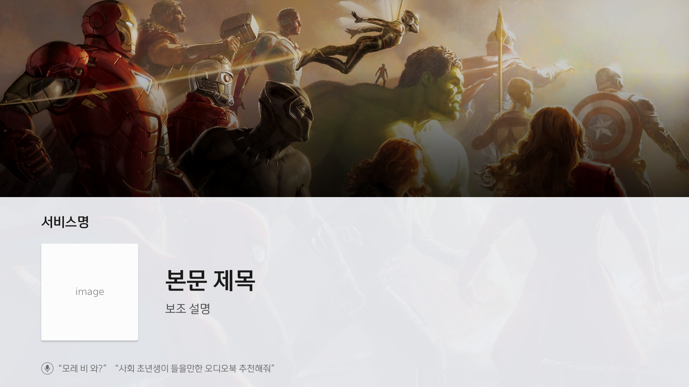
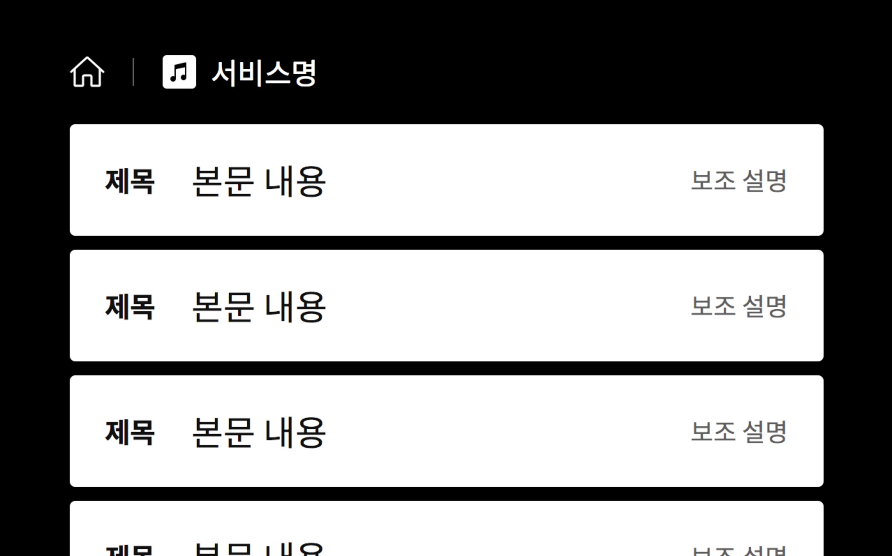
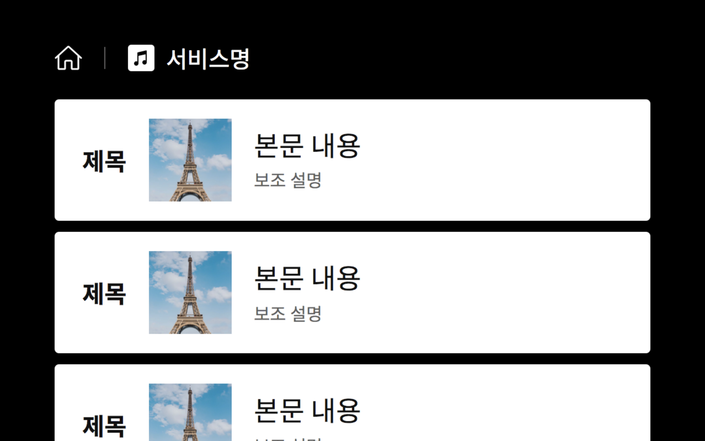
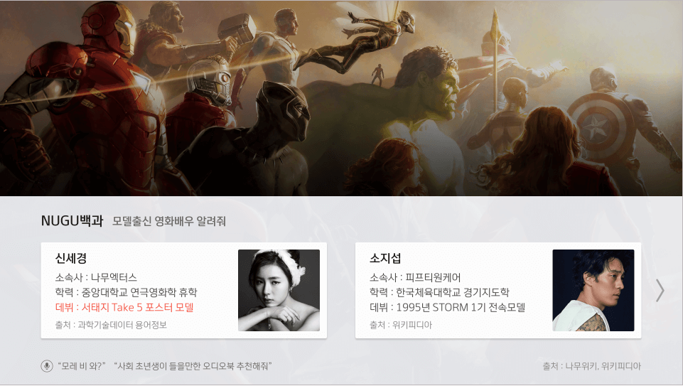

# Display Interface

Display Interface를 사용하면 화면을 가진 디바이스에서 화면에 필요한 정보를 보여줄 수 있습니다. Display Interface 사용함으로 활성화한 Play는 Display Template을 구성하여 화면을 제어할 수 있습니다. 디바이스와 관계없이 하나의 Template이 여러 디스플레이 대응하게 됩니다. 

Display Interface를 사용하기 위해서는 우선 `General` &gt; `기본 정보` 페이지의 Capability Interface에서 `Display 제어` 항목을 `ON`으로 설정해야 합니다.



Display Interface는 AudioPlayer를 위한 Display와 중첩하여 사용할 수 없습니다. 


## 지원 디바이스 및 해상도

현재 Display Interface를 지원하는 디바이스와 해상는 다음과 같습니다.

| 디바이스 | Size \(px\) | Orientation |
| :---: | :---: | :---: |
| NU300 | 1280 x 800 | Landscape |
| Btv | 1920 x 1080 | Landscape |

## Template 유형 모아보기

다음과 같은 유형의 Template 들을 사용할 수 있습니다.  

| Type  | NU300 |  Btv |
| :--- | :---: | :---: |
| FullText1 |  |  |
| FullText2 |  |  |
| ImageText1 |  |  |
| ImageText2 |  |  |
| ImageText3 |  |  |
| ImageText4 |  |  |
| TextList1 |  |  |
| TextList2 |  |  |
| TextList3 |  |  |
| ImageList1 |  |  |
| ImageList2 |  |  |

## 


### Context \(확인 필요\) <a id="id-1.DisplayInterface-3.Context"></a>

_Template이 display되는 동안 display 중인 template의 token 값을 전달됩니다. Event가 발생하는 경우는 template display되는 상황이기 때문에 context는 함께 전달됩니다._

```text
{
    "Display": {
        "version": "1.0",
        "playServiceId": "{{STRING}}",
        "token": "{{STRING}}"
    }
}
```

| parameter | type | mandatory | description |
| :--- | :---: | :---: | :--- |
| version | string | Y | 인터페이스 버전 |
| playServiceId | string | N | template을 전송한 Play의 play service id |
| token | string | N | 클릭하는 template을 식별하기 위한 unique identifier |


## 화면 구성 요소

Template 별로 알아보기 전에, 화면 구성 요소에 대해 알아보겠습니다. 

### TitleObject

화면 상단의 타이틀 영역에 들어갈 요소입니다. NU300 화면 상단 왼쪽의 홈 버튼은 기본으로 제공되는 버튼으로 Title Object와는 무관합니다.. 

```text
{
    "logo": ImageObject,
    "text": TextObject,
    "subtext" : TextObject,
    "subicon" : ImageObject,
    "button" : TextObject
}
```


<table>
  <thead>
    <tr>
      <th style="text-align:left">Parameter</th>
      <th style="text-align:left">Type</th>
      <th style="text-align:left">Mandatory</th>
      <th style="text-align:left">Description</th>
      <th style="text-align:left">NU300</th>
      <th style="text-align:left">Btv</th>
    </tr>
  </thead>
  <tbody>
    <tr>
      <td style="text-align:left">logo</td>
      <td style="text-align:left">ImageObject</td>
      <td style="text-align:left">Y</td>
      <td style="text-align:left">&#xD22C;&#xBA85; &#xBC30;&#xACBD;&#xC758; &#xC774;&#xBBF8;&#xC9C0;&#xB85C;
        &#xC81C;&#xACF5;&#xD574;&#xC57C; &#xD568;(PNG &#xD0C0;&#xC785;)</td>
      <td
      style="text-align:left">
        <p>50x50</p>
        <p>&#xAC00;&#xB85C; Size Flexible</p>
        </td>
        <td style="text-align:left">
          <p>STB2&#xBD80;&#xD130; &#xC801;&#xC6A9; &#xC608;&#xC815;</p>
          <p>&#xC0AC;&#xC774;&#xC988; &#xBBF8;&#xC815;</p>
        </td>
    </tr>
    <tr>
      <td style="text-align:left">text</td>
      <td style="text-align:left">TextObject</td>
      <td style="text-align:left">Y</td>
      <td style="text-align:left">&#xC81C;&#xBAA9;</td>
      <td style="text-align:left">42sp, #FFFFFF &#xC73C;&#xB85C; &#xBCF4;&#xC5EC;&#xC9D1;&#xB2C8;&#xB2E4;.</td>
      <td
      style="text-align:left">36sp, #1a1a1a &#xC73C;&#xB85C; &#xBCF4;&#xC5EC;&#xC9D1;&#xB2C8;&#xB2E4;.</td>
    </tr>
    <tr>
      <td style="text-align:left">subtext</td>
      <td style="text-align:left">TextObject</td>
      <td style="text-align:left">N</td>
      <td style="text-align:left">&#xBD80;&#xC81C;&#xBAA9;</td>
      <td style="text-align:left">&#xACF5;&#xBC31; &#xD3EC;&#xD568; 20&#xC790;</td>
      <td style="text-align:left"></td>
    </tr>
    <tr>
      <td style="text-align:left">subicon</td>
      <td style="text-align:left">ImageObject</td>
      <td style="text-align:left">N</td>
      <td style="text-align:left">subText &#xC67C;&#xCABD;&#xC5D0; &#xB178;&#xCD9C;&#xB420; &#xC11C;&#xBE0C;&#xC544;&#xC774;&#xCF58;</td>
      <td
      style="text-align:left">
        <p>&#xC704;&#xCE58; : subText &#xC67C;&#xCABD;</p>
        <p>size : 36 x 36dp</p>
        </td>
        <td style="text-align:left">
          <p>&#xC704;&#xCE58; : subText &#xC67C;&#xCABD;</p>
          <p>size : 30 x 30dp</p>
        </td>
    </tr>
    <tr>
      <td style="text-align:left">button</td>
      <td style="text-align:left">TextObject</td>
      <td style="text-align:left">N</td>
      <td style="text-align:left">
        <p>&#xC6B0;&#xCE21;&#xC5D0; &#xC704;&#xCE58;&#xD558;&#xB294; &#xBC84;&#xD2BC;</p>
        <p>(&#xBC84;&#xD2BC; &#xC548;&#xC758; Text&#xB9CC; &#xC815;&#xC758;&#xAC00;&#xB2A5;)</p>
      </td>
      <td style="text-align:left"></td>
      <td style="text-align:left"></td>
    </tr>
  </tbody>
</table>

### ImageObject

```text
{
    "contentDescription": "{{STRING}}",
    "sources": [
        {
            "url": "{{STRING}}",
            "size": "{{STRING}}",
            "widthPixels": 1920,
            "heightPixels": 1080
        },
        {
            "url": "{{STRING}}",
            "size": "{{STRING}}",
            "widthPixels": 480,
            "heightPixels": 320
        },
        {...}
    ]
}
```

<table>
  <thead>
    <tr>
      <th style="text-align:left">Parameter</th>
      <th style="text-align:center">Type</th>
      <th style="text-align:center">Mandatory</th>
      <th style="text-align:left">Description</th>
    </tr>
  </thead>
  <tbody>
    <tr>
      <td style="text-align:left">contentDescription</td>
      <td style="text-align:center">string</td>
      <td style="text-align:center">N</td>
      <td style="text-align:left"></td>
    </tr>
    <tr>
      <td style="text-align:left">heightPixels</td>
      <td style="text-align:center">long</td>
      <td style="text-align:center">N</td>
      <td style="text-align:left">&#xC815;&#xD655;&#xD55C; &#xAC12;&#xC774; &#xC544;&#xB2C8;&#xB77C;&#xBA74;,
        &#xC0AC;&#xC6A9;&#xD558;&#xC9C0; &#xC54A;&#xB294; &#xAC83;&#xC744; &#xAD8C;&#xC7A5;&#xD569;&#xB2C8;&#xB2E4;.</td>
    </tr>
    <tr>
      <td style="text-align:left">size</td>
      <td style="text-align:center">string</td>
      <td style="text-align:center">N</td>
      <td style="text-align:left">
        <p>X_SMALL, SMALL, MEDIUM, LARGE, X_LARGE</p>
        <p>&#xD654;&#xBA74; &#xD06C;&#xAE30;&#xBCC4; &#xCD5C;&#xC801;&#xD654;&#xB97C;
          &#xC704;&#xD574; size &#xC815;&#xBCF4;&#xB97C; &#xB123;&#xB294; &#xAC83;&#xC744;
          &#xAD8C;&#xC7A5;&#xD569;&#xB2C8;&#xB2E4;.</p>
        <p>Value&#xBCC4; &#xAD8C;&#xC7A5; &#xC0AC;&#xC774;&#xC988;&#xB294; &#xC544;&#xB798;&#xC758;
          &#xD45C;&#xB97C; &#xCC38;&#xACE0;&#xD558;&#xC138;&#xC694;.</p>
      </td>
    </tr>
    <tr>
      <td style="text-align:left">sources</td>
      <td style="text-align:center">list</td>
      <td style="text-align:center">Y</td>
      <td style="text-align:left">&#xB9AC;&#xC2A4;&#xD2B8;&#xB85C; &#xC81C;&#xACF5;&#xB418;&#xBA70; &#xD074;&#xB77C;&#xC774;&#xC5B8;&#xD2B8;&#xC5D0;&#xC11C;
        &#xD654;&#xBA74; &#xD06C;&#xAE30;&#xC5D0; &#xAC00;&#xC7A5; &#xC801;&#xD569;&#xD55C;
        &#xC774;&#xBBF8;&#xC9C0;&#xB97C; &#xC0AC;&#xC6A9;&#xD574;&#xC57C; &#xD569;&#xB2C8;&#xB2E4;.</td>
    </tr>
    <tr>
      <td style="text-align:left">url</td>
      <td style="text-align:center">string</td>
      <td style="text-align:center">Y</td>
      <td style="text-align:left"></td>
    </tr>
    <tr>
      <td style="text-align:left">widthPixels</td>
      <td style="text-align:center">long</td>
      <td style="text-align:center">N</td>
      <td style="text-align:left">&#xC815;&#xD655;&#xD55C; &#xAC12;&#xC774; &#xC544;&#xB2C8;&#xB77C;&#xBA74;,
        &#xC0AC;&#xC6A9;&#xD558;&#xC9C0; &#xC54A;&#xB294; &#xAC83;&#xC744; &#xAD8C;&#xC7A5;&#xD569;&#xB2C8;&#xB2E4;.</td>
    </tr>
  </tbody>
</table>

| Size Value | Recommended Size \(in pixels\) |
| :---: | :---: |
| X\_SMALL | 480 x 320 |
| SMALL | 720 x 480 |
| MEDIUM | 960 x 640 |
| LARGE | 1280 x 800 |
| X\_LARGE | 1920 x 1080 |

### 

### BackgroundObject

* image와 color가 동시에 존재하면 image의 우선순위가 높음

<table>
  <thead>
    <tr>
      <th style="text-align:left">parameter</th>
      <th style="text-align:left">type</th>
      <th style="text-align:left">mandatory</th>
      <th style="text-align:left">description</th>
    </tr>
  </thead>
  <tbody>
    <tr>
      <td style="text-align:left">image</td>
      <td style="text-align:left">ImageObject</td>
      <td style="text-align:left">N</td>
      <td style="text-align:left"></td>
    </tr>
    <tr>
      <td style="text-align:left">color</td>
      <td style="text-align:left">string</td>
      <td style="text-align:left">N</td>
      <td style="text-align:left">
        <p>color &#xD615;&#xC2DD; (RGB)</p>
        <p>default - #000000</p>
      </td>
    </tr>
    <tr>
      <td style="text-align:left">opacity</td>
      <td style="text-align:left">number</td>
      <td style="text-align:left">N</td>
      <td style="text-align:left">NU300&#xC5D0;&#xB9CC; &#xC720;&#xD6A8;&#xD558;&#xBA70;,
        <br />default&#xAC12;&#xC740; 0.7</td>
    </tr>
  </tbody>
</table>### Text Object

<table>
  <thead>
    <tr>
      <th style="text-align:left">parameter</th>
      <th style="text-align:left">type</th>
      <th style="text-align:left">mandatory</th>
      <th style="text-align:left">description</th>
    </tr>
  </thead>
  <tbody>
    <tr>
      <td style="text-align:left">color</td>
      <td style="text-align:left">string</td>
      <td style="text-align:left">N</td>
      <td style="text-align:left">
        <p>color &#xD615;&#xC2DD; (RGB)</p>
        <p>default &#xAC12;&#xC740; &#xB514;&#xBC14;&#xC774;&#xC2A4;&#xB9C8;&#xB2E4;
          &#xB2E4;&#xB984;</p>
      </td>
    </tr>
    <tr>
      <td style="text-align:left">style</td>
      <td style="text-align:left">json</td>
      <td style="text-align:left">N</td>
      <td style="text-align:left">
        <p>&#xAE30;&#xBCF8;&#xC801;&#xC73C;&#xB85C;&#xB294; &#xC0C1;&#xC704; &#xC2A4;&#xD0C0;&#xC77C;(directive
          &#xB4F1;)&#xC744; &#xB530;&#xB974;&#xBA70;, &#xD604;&#xC7AC; FullText1,2&#xC758;
          body text&#xC5D0;&#xB9CC; &#xC801;&#xC6A9; &#xAC00;&#xB2A5;.</p>
        <p>CSS &#xC18D;&#xC131;&#xC740; &#xBAA8;&#xB450; &#xAC00;&#xB2A5;&#xD558;&#xBA70;,
          &#xB2E4;&#xC74C;&#xC758; &#xAC12;&#xB4E4;&#xC744; &#xAC00;&#xC9C8; &#xC218;
          &#xC788;&#xB2E4;.</p>
        <ul>
          <li>text-align : left, center, right</li>
          <li>opacity : 0 ~ 1</li>
          <li>display : block, inline, none</li>
          <li>margin : 10px</li>
        </ul>
        <p>
          <br />&#xC0AC;&#xC6A9;&#xC608;.
          <br />{ &quot;text-align&quot;:&quot;center&quot;, &quot;display&quot;: &quot;block&quot;
          }</p>
      </td>
    </tr>
    <tr>
      <td style="text-align:left">text</td>
      <td style="text-align:left">string</td>
      <td style="text-align:left">Y</td>
      <td style="text-align:left"></td>
    </tr>
  </tbody>
</table>* TextObject는 Scrollable이 명시된 경우만 스크롤이 가능하고, 명시되어 있지 않으면 default로 스크롤 불가


## Template 유형별 Spec.

Display Interface에서는 크게 4종류의 Template을 제공합니다. 

* FullText : 텍스트로 화면을 구성할 때 사용합니다.
* ImageText : 이미지와 텍스트를 함께 구성할 때 사용합니다. 
* TextList : 텍스트를 중심으로 리스트를 표현할 때 사용합니다. 
* IamgeList : 이미지를 중심으로 리스트를 표현할 때 사용합니다.

### FullText1


### FullText2


### ImageText1


### ImageText2


### ImageText3


### ImageText4


### TextList1


### TextList2


### TextList3


### ImageList1


### ImageList2


