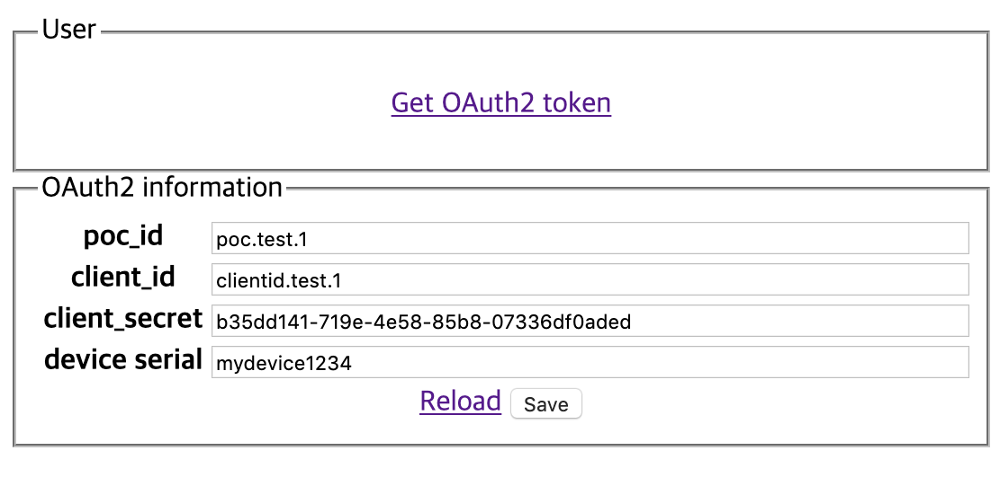
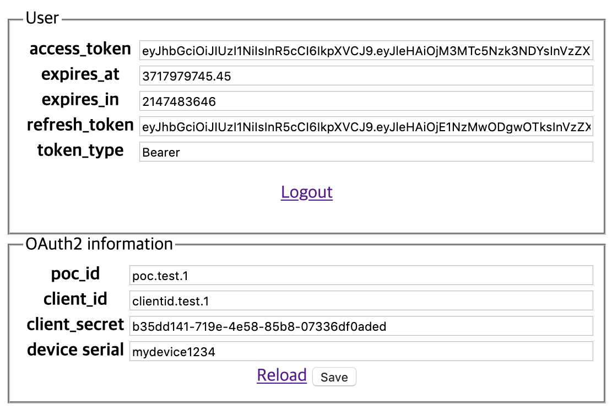

# 시작하기

## Introduction

NUGU SDK는 Linux 기반의 다양한 임베디드 장치에 NUGU 서비스를 쉽게 동작시키기 위해 Linux SDK를 제공합니다. 

Linux SDK는 개발자들이 원하는 기능을 구현할 수 있도록 C/C++ API와 문서를 제공하고 있으며, 아래와 같은 특징을 가지고 있습니다.

* deb 패키지\(데비안 패키지\)로 배포하여 쉽게 설치 가능.
* SDK 자체에서 plug-in 구조를 지원하여, 디바이스 특성에 따라 쉽게 Porting 가능. \(GStreamer, PortAudio, Opus decoder 등의 기본 plug-in 함께 제공\)
* GMainloop 기반으로 구현되어 event-driven 방식의 Application 개발 용이.

또한, Linux SDK에 포함되어 있는 Sample application을 통해 쉽게 동작을 테스트해 볼 수 있습니다.

## Supported platforms

Linux SDK는 현재 Ubuntu 리눅스를 공식적으로 지원하고 있습니다. 지원하는 버전은 **Xenial**\(16.04\)과 **Bionic**\(18.04\)이고, 차후 Ubuntu에서 새로운 LTS\(Long Term Support\) 버전이 Release 될 경우 지원 목록에 추가될 수 있습니다.

그리고, 다양한 장치를 지원하기 위해 64bit x86, arm\(armhf, arm64\) architecture를 지원합니다.


사용 중인 Linux가 Debian 계열의 리눅스\(deb 패키지 설치가 가능\)일 경우, NUGU SDK 설치가 가능 할 수 있습니다. 하지만 현재는 Ubuntu만 공식적으로 지원하고 있기 때문에 다른 배포판에 대한 이슈 대응은 늦어질 수 있습니다.


## Install the SDK

Linux SDK는 개발에 필요한 Library와 Header 파일들은 `deb` 패키지\(데비안 소프트웨어 패키지 포맷\) 형태로 배포하고 있습니다. 또한 개발자들이 `deb` 파일을 쉽게 다운로드 받아 설치하여 사용할 수 있도록 Ubuntu에서 제공하는 [PPA](https://launchpad.net/~nugulinux/+archive/ubuntu/sdk)\([https://launchpad.net](https://launchpad.net)\)를 사용하고 있습니다.

### PPA 추가하기

아래 명령을 통해 시스템에 Linux SDK PPA를 추가할 수 있습니다.



```bash
sudo add-apt-repository ppa:nugulinux/sdk
sudo apt-get update
```



사용하고 있는 Debian 버전에 따라 NUGU SDK의 Bionic 또는 Xenial PPA 주소를 추가해야 합니다.

```bash
# Debian 버전이 Buster일 경우
$ sudo vi /etc/apt/sources.list.d/nugu.list
deb http://ppa.launchpad.net/nugulinux/sdk/ubuntu bionic main

# Debian 버전이 Stretch일 경우
$ sudo vi /etc/apt/sources.list.d/nugu.list
deb http://ppa.launchpad.net/nugulinux/sdk/ubuntu xenial main
```

이제 NUGU SDK PPA에 대한 인증키를 설치해야 합니다.

```bash
sudo apt-key adv --keyserver 'hkp://keyserver.ubuntu.com:80' --recv-key 5DE933034EEA59C4
```



### 설치하기

Linux SDK는 아래의 패키지들을 제공하고 있습니다. 기본적인 동작을 위해서 `libnugu`와 `libnugu-plugins-default` 패키지가 필요하며 개발시에는 빌드를 위해 `libnugu-dev` 패키지가 추가로 필요합니다.

| 패키지 | 설명 |
| :--- | :--- |
| `libnugu` | NUGU SDK 동작에 필요한 파일 - Shared library\(`*.so.{version}` files\) |
| `libnugu-plugins-default` | NUGU SDK Default plugins - `gstreamer.so`, `opus.so`, `portaudio.so` 등 |
| `libnugu-dev` | NUGU SDK 개발에 필요한 파일 - header files\(`*.h`, `*.hh`\), pkg-config\(`nugu.pc`\) 및 `libnugu.so` |
| `libnugu-examples` | NUGU SDK Examples \(콘솔 기반의 샘플 프로그램 및 OAuth2 클라이언트\) |

아래 명령을 통해 시스템에 설치할 수 있습니다.

```bash
sudo apt-get install libnugu libnugu-plugins-default libnugu-dev libnugu-examples
```

## Sample application

본격적으로 개발을 시작하기 전에 먼저 Linux SDK의 기능을 확인해 볼 수 있도록 아래와 같이 2가지 샘플을 제공하고 있습니다.

* 인증을 위한 OAuth2 예제 - Python으로 작성된 Web 기반의 OAuth2 client sample
* SDK 기능 동작을 테스트하기 위한 예제 - 콘솔에서 동작하는 텍스트 기반의 Sample application

위 샘플들은 `libnugu-examples` 패키지안에 모두 포함되어 있으며, 아래 파일들이 설치됩니다.

| 파일 | 설명 |
| :--- | :--- |
| `/usr/bin/nugu_oob_server` | OAuth2 인증을 위한 웹서버 - Python script, `8080` 포트 사용 |
| `/usr/bin/nugu_sample` | 콘솔 기반의 Sample application |
| `/usr/bin/nugusdk_start_sample` | 저장된 인증 토큰 값을 읽어서 환경 변수로 설정해주는 ㄴshell script |
| `/lib/systemd/system/nugu_oob.service` | 시스템 시작시 OAuth2 인증 웹서버를 자동으로 실행시키기 위한 systemd 설정 파일 |

### OAuth2 인증 예제

웹브라우저를 통해 [http://lvh.me:8080 ](http://lvh.me:8080%20)주소\(lvh.me는 localhost와 같습니다\)로 접속하면 아래와 같이 OAuth2 인증을 위한 샘플 화면이 나타납니다.


인증을 위해 미리 발급받은 `poc_id`, `client_id`, `client_secret`을 입력하고, 테스트 하려는 디바이스를 구분하기 위해 `device serial`에 중복되지 않는 임의의 값\(예: mydevice1234\)을 입력 한 후 **Save** 버튼을 눌러 저장합니다.



이제 **Get OAuth2 token** 링크를 눌러 인증을 진행하면, 아래와 같이최종적으로 `access_token`을 얻을 수 있습니다.



위 정보들은 `/var/lib/nugu/nugu-auth.json` 파일에 아래와 같은 JSON 형태로 저장됩니다. 

```javascript
{
    "refresh_token" : "...",
    "access_token" : "...",
    "expires_in" : ...,
    "token_type" : "Bearer",
    "expires_at" : ...,
    "jti" : "..."
}
```

### 음성 인식 처리를 위한 Model 파일 다운로드 받기

NUGU 서비스에서는 음성 인식 처리를 위해 아래의 음성 Model 파일을 필요로 합니다.

* Wake word\("아리아"\) detection을 위한 model 파일
* VAD\(voice activity detection\)을 위한 model 파일

위 파일들은 Nugu developers 사이트에서 사용 약관에 동의 후 다운로드 받으실 수 있습니다.

다운로드 받은 파일들을 Linux SDK에서 사용하기 위해서는, 디바이스에 임의의 디렉토리를 생성한 후 아래와 같은 파일명으로 복사해 주시면 됩니다.

* `nugu_model_wakeup_net.raw`  - wake word detection에 사용되는 model 파일 \(1/2\)
* `nugu_model_wakeup_search.raw`  - wake word detection에 사용되는 model 파일 \(2/2\)
* `nugu_model_epd.raw` - VAD에 사용되는 model 파일

### Sample application 실행하기

Sample application은 환경 변수\(`NUGU_TOKEN`\)를 통해 인증 정보를 전달 받아 실행합니다. 따라서, 직접 환경 변수의 값을를 설정한 후 실행하거나, `nugusdk_start_sample` shell script를 사용해서 실행할 수 있습니다.



```bash
$ nugusdk_start_sample /usr/bin/nugu_sample -m {model-file-path}
```



```bash
$ export NUGU_TOKEN=...
$ /usr/bin/nugu_sample -m {model-file-path}
```



정상적으로 실행이 되면, 아래와 같이 텍스트 기반의 UI가 콘솔에 표시됩니다.

```bash
=======================================================
NUGU SDK Command (Connected)
=======================================================
w : start wakeup
l : start listening
s : stop listening
t : text input
c : connect
d : disconnect
q : quit
-------------------------------------------------------
Select Command >
```

사용할 수 있는 명령들에 대한 설명은 아래와 같습니다.

<table>
  <thead>
    <tr>
      <th style="text-align:left">&#xBA85;&#xB839;</th>
      <th style="text-align:left">&#xC124;&#xBA85;</th>
    </tr>
  </thead>
  <tbody>
    <tr>
      <td style="text-align:left"><code>w</code> (start wakeup)</td>
      <td style="text-align:left">&#xC815;&#xD574;&#xC9C4; Wake word(&quot;&#xC544;&#xB9AC;&#xC544;&quot;)&#xB97C;
        &#xD1B5;&#xD574; wake-up &#xD558;&#xAE30; &#xC704;&#xD55C; &#xB300;&#xAE30;
        &#xC0C1;&#xD0DC;&#xB85C; &#xC9C4;&#xC785;&#xD569;&#xB2C8;&#xB2E4;.</td>
    </tr>
    <tr>
      <td style="text-align:left"><code>l</code> (start listening)</td>
      <td style="text-align:left">
        <p>wake-up &#xC5C6;&#xC774; &#xBC14;&#xB85C; &#xC74C;&#xC131; &#xBC1C;&#xD654;&#xB97C;
          NUGU &#xC11C;&#xBE44;&#xC2A4;&#xC5D0; &#xC804;&#xB2EC;&#xD569;&#xB2C8;&#xB2E4;.</p>
        <p>&#xBC1C;&#xD654;&#xAC00; &#xB05D;&#xB098;&#xBA74; NUGU &#xC11C;&#xBE44;&#xC2A4;&#xB85C;&#xBD80;&#xD130;
          &#xC751;&#xB2F5;(TTS)&#xC744; &#xBC1B;&#xC2B5;&#xB2C8;&#xB2E4;.</p>
        <p>&#xC704; &#xACFC;&#xC815;&#xC774; &#xB05D;&#xB098;&#xBA74; &#xC790;&#xB3D9;&#xC73C;&#xB85C;
          &#xB2E4;&#xC2DC; wake-up &#xB300;&#xAE30; &#xC0C1;&#xD0DC;&#xB85C; &#xC804;&#xD658;&#xB429;&#xB2C8;&#xB2E4;.</p>
      </td>
    </tr>
    <tr>
      <td style="text-align:left"><code>s</code> (stop listening)</td>
      <td style="text-align:left">&#xBC1C;&#xD654;&#xB97C; &#xAC15;&#xC81C;&#xB85C; &#xC911;&#xC9C0; &#xC2DC;&#xD0B5;&#xB2C8;&#xB2E4;.</td>
    </tr>
    <tr>
      <td style="text-align:left"><code>t</code> (text input)</td>
      <td style="text-align:left">
        <p>&#xD14D;&#xC2A4;&#xD2B8;(&#xC608;: &quot;&#xC624;&#xB298; &#xBA70;&#xCE60;&#xC774;&#xC57C;&quot;)&#xB97C;
          NUGU &#xC11C;&#xBE44;&#xC2A4;&#xC5D0; &#xC804;&#xB2EC;&#xD569;&#xB2C8;&#xB2E4;.</p>
        <p>&#xC74C;&#xC131; &#xBC1C;&#xD654;&#xC640; &#xB3D9;&#xC77C;&#xD558;&#xAC8C;
          NUGU &#xC11C;&#xBE44;&#xC2A4;&#xC5D0;&#xC11C; &#xC751;&#xB2F5;&#xC744;
          &#xBC1B;&#xC744; &#xC218; &#xC788;&#xC2B5;&#xB2C8;&#xB2E4;.</p>
      </td>
    </tr>
    <tr>
      <td style="text-align:left"><code>c</code> (connect)</td>
      <td style="text-align:left">
        <p>NUGU &#xC11C;&#xBE44;&#xC2A4;&#xC5D0; &#xB124;&#xD2B8;&#xC6CC;&#xD06C;&#xB97C;
          &#xC5F0;&#xACB0;&#xD569;&#xB2C8;&#xB2E4;.</p>
        <p>(&#xCC38;&#xACE0;&#xB85C;, Sample application &#xC2E4;&#xD589;&#xC2DC;
          &#xC790;&#xB3D9;&#xC73C;&#xB85C; &#xC5F0;&#xACB0;&#xC744; &#xC2DC;&#xB3C4;&#xD569;&#xB2C8;&#xB2E4;.)</p>
      </td>
    </tr>
    <tr>
      <td style="text-align:left"><code>d</code> (disconnect)</td>
      <td style="text-align:left">NUGU &#xC11C;&#xBE44;&#xC2A4;&#xC5D0; &#xC5F0;&#xACB0;&#xB41C; &#xB124;&#xD2B8;&#xC6CC;&#xD06C;&#xB97C;
        &#xB04A;&#xC2B5;&#xB2C8;&#xB2E4;.</td>
    </tr>
    <tr>
      <td style="text-align:left"><code>q</code> (quit)</td>
      <td style="text-align:left">Sample application&#xC744; &#xC885;&#xB8CC;&#xD569;&#xB2C8;&#xB2E4;.</td>
    </tr>
  </tbody>
</table>이제 `w` 명령을 통한 실제 사용 예제를 보여 드리겠습니다.

```bash
Select Command > w
[Wakeup] wakeup detecting...
```

상태가 wakeup detecting 모드로 전환된 것을 확인할 수 있습니다. 이제 "**아리아**" 라고 발화를 하면 아래와 같이 wakeup이 되고, 자동으로 사용자의 음성을 듣기 위해 Listening 모드로 전환됩니다.

```bash
[Wakeup] wakeup detected
[ASR] LISTENING
```

이제 "**오늘 며칠이야**" 라고 발화를 하면 Recognizing으로 상태로 바뀌면서 음성 데이터를 NUGU 서비스로 전송하게 됩니다. 사용자 발화가 다 끝나면 NUGU 서비스로부터 응답을 받기 위해 Busy 상태로 전환됩니다.

```bash
[ASR] RECOGNIZING
[ASR] BUSY
```

NUGU 서비스로부터 응답이 오면 해당 발화에 대한 인식 결과를 보여주고 자동으로 다시 Wakeup 대기 상태로 전환됩니다. 그리고 발화에 대한 결과로 TTS 음성을 출력합니다.

```bash
[ASR] onComplete : 오늘 며칠이야
[ASR] IDLE
[Wakeup] wakeup detecting...
[TTS] tts playing...
[TTS] text : 오늘은 10월 4일 금요일입니다.
[TTS] tts playing finished
```

## Create your first application

API ...

Build ...


