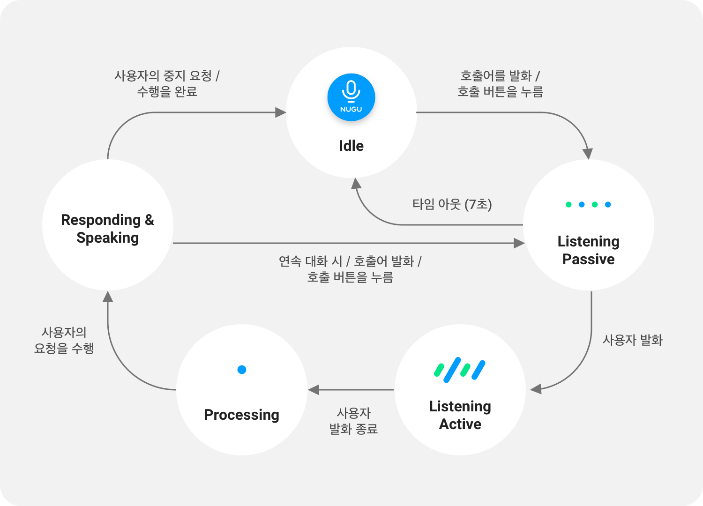

# NUGU 대화 상태

## NUGU 대화 상태 

NUGU 대화의 상태는 크게 idle, listening, processing, responding의 4단계로 나눠질 수 있습니다. 먼저 대기상태\(idle state\)에서 사용자가 호출어\(wake-up word\)를 발화하거나 호출 버튼을 누르면 NUGU가 사용자의 명령을 받아들일 수 있는 상태\(listening-passive\)로 변경됩니다. 이때 사용자가 말하기 시작하면 사용자의 발화를 입력 받는 상태\(listening-active\)로 변경되며, 사용자의 발화가 종료되면 동작을 결정하는 단계\(processing\)를 거쳐 명령에 대한 답변이나 동작을 수행\(responding\)하게 됩니다. 각 상태의 기본 흐름은 아래와 같습니다.

각 상태 별 정의는 아래와 같습니다.

| 상태  | 정의  |
| :--- | :--- |
| **Idle** | Wake up 가능한 대기 상태 |
| **Listening – Passive** | 사용자 발화 입력 대기 상태 |
| **Listening – Active**                                   | 사용자 발화 입력 중 상태 |
| **Processing** | 입력된 사용자 발화를 분석하는 상태 |
| **Responding - Speaking** | 정보나 동작에 대한 TTS를 제공하는 상태 |
| **Responding - Playing** | 콘텐츠를 재생하는 상태 |
| **Responding - Error** | 발화한 명령에 대한 동작을 수행할 수 없어, 이에 대한 피드백을 제공하는 상태. Speaking 상태 대신 발생 |

사용자가 wake up 시키지 않더라도, NUGU가 스스로 깨어나서 동작을 수행하는 경우가 있는데, 이를 alert 상태라고 하며 아래와 같이 나뉠 수 있습니다.

| Alert 상태  | 정의  |
| :--- | :--- |
| **Alert - Message**            | 새로운 알림 메시지가 수신된 상태 |
| **Alert - Sound** | 사운드 알림 수신되어 이를 표출중인 상 \(알람, 타이머, 전화 수신\) |

NUGU의 각 상태에서 호출 버튼을 눌렀을 때의 상태 변화는 다음과 같습니다.

<table>
  <thead>
    <tr>
      <th style="text-align:left"><b>&#xD604;&#xC7AC; &#xC0C1;&#xD0DC;</b>
      </th>
      <th style="text-align:left"><b>&#xD638;&#xCD9C; &#xBC84;&#xD2BC; &#xB20C;&#xB800;&#xC744; &#xB54C;&#xC758; &#xC0C1;&#xD0DC; &#xBCC0;&#xD654;</b>
      </th>
    </tr>
  </thead>
  <tbody>
    <tr>
      <td style="text-align:left"><b>Listening &#x2013; Passive                                                                    </b>
      </td>
      <td style="text-align:left">listening &#xC0C1;&#xD0DC;&#xAC00; &#xD574;&#xC81C;&#xB418;&#xC5B4; idle
        &#xC0C1;&#xD0DC;&#xB85C; &#xB3CC;&#xC544;&#xAC10;</td>
    </tr>
    <tr>
      <td style="text-align:left"><b>Listening &#x2013; Active</b>
      </td>
      <td style="text-align:left">&#xD638;&#xCD9C; &#xBC84;&#xD2BC;&#xC744; &#xB204;&#xB974;&#xAE30; &#xC804;&#xAE4C;&#xC9C0;
        &#xC785;&#xB825;&#xB41C; &#xC0AC;&#xC6A9;&#xC790; &#xBC1C;&#xD654; &#xAE4C;&#xC9C0;&#xB9CC;
        &#xC785;&#xB825; &#xBC1B;&#xACE0; processing &#xC0C1;&#xD0DC; &#xC9C4;&#xC785;</td>
    </tr>
    <tr>
      <td style="text-align:left"><b>Alert &#x2013; Message</b>
      </td>
      <td style="text-align:left">&#xC218;&#xC2E0;&#xB41C; &#xBA54;&#xC2DC;&#xC9C0;&#xB97C; Prompt&#xB85C;
        &#xC81C;&#xACF5;&#xD558;&#xB294; speaking &#xC0C1;&#xD0DC; &#xC9C4;&#xC785;</td>
    </tr>
    <tr>
      <td style="text-align:left"><b>Alert &#x2013; Sound</b>
      </td>
      <td style="text-align:left">&#xC0AC;&#xC6B4;&#xB4DC; &#xC7AC;&#xC0DD;&#xC774; &#xC911;&#xC9C0;&#xB418;&#xACE0;
        listening &#x2013; passive &#xC0C1;&#xD0DC; &#xC9C4;&#xC785;</td>
    </tr>
    <tr>
      <td style="text-align:left">
        
<b>Responding &#x2013; speaking</b>
        

        
<b>Responding &#x2013; error</b>
        

      </td>
      <td style="text-align:left">
        
&#x2022; Prompt&#xAC00; &#xC911;&#xC9C0;&#xB418;&#xACE0; listening &#x2013;
          passive &#xC0C1;&#xD0DC; &#xC9C4;&#xC785;

        
&#x2022; &#xC774;&#xD6C4; &#xC774;&#xC5B4;&#xC9C0;&#xB294; &#xC0AC;&#xC6A9;&#xC790;
          &#xBC1C;&#xD654;&#xC5D0; &#xB300;&#xD574; Prompt&#xAC00; &#xC544;&#xB2CC;
          &#xB3D9;&#xC791;(&#xBCFC;&#xB968; &#xC870;&#xC808;, &#xC7AC;&#xC0DD;, &#xC7AC;&#xC2DC;&#xC791;
          &#xB4F1;)&#xC744; &#xC218;&#xD589;&#xD558;&#xB294; &#xACBD;&#xC6B0;&#xC5D0;&#xB294;
          &#xB3D9;&#xC791;&#xC744; &#xBA3C;&#xC800; &#xC218;&#xD589;&#xD55C; &#xD6C4;,
          &#xC911;&#xC9C0;&#xB418;&#xC5C8;&#xB358; Prompt&#xB97C; &#xCC98;&#xC74C;&#xBD80;&#xD130;
          &#xC7AC;&#xC2DC;&#xC791;

        
&#x2022; &#xC0AC;&#xC6A9;&#xC790; &#xBC1C;&#xD654;&#xC5D0; &#xB300;&#xD574;
          Prompt&#xB97C; &#xC81C;&#xACF5;&#xD558;&#xB294; &#xACBD;&#xC6B0;&#xC5D0;&#xB294;
          &#xC911;&#xC9C0;&#xB418;&#xC5C8;&#xB358; Prompt&#xB294; &#xBB34;&#xC2DC;&#xB428;.

        
&#x2022; 1&#xC74C;&#xC808; &#xBC1C;&#xD654;, &#xC18C;&#xC74C;, &#xBB34;&#xC74C;
          &#xB4F1; &#xBC1C;&#xD654; &#xBBF8;&#xC778;&#xC2DD;&#xC73C;&#xB85C; &#xCC98;&#xB9AC;&#xB41C;
          &#xACBD;&#xC6B0;&#xC5D0;&#xB3C4; &#xC7AC;&#xC0DD;&#xC911;&#xC774;&#xC5C8;&#xB358;
          Prompt&#xB294; &#xBB34;&#xC2DC;&#xB428;

      </td>
    </tr>
    <tr>
      <td style="text-align:left"><b>Responding</b>  <b>- Playing</b>
      </td>
      <td style="text-align:left">
        
&#x2022; Playing&#xC744; &#xC77C;&#xC2DC;&#xC815;&#xD558;&#xACE0; listening
          &#x2013; passive &#xC0C1;&#xD0DC; &#xC9C4;&#xC785;

        
&#x2022; &#xC774;&#xD6C4; &#xC774;&#xC5B4;&#xC9C0;&#xB294; &#xC0AC;&#xC6A9;&#xC790;
          &#xBC1C;&#xD654;&#xC5D0; &#xB300;&#xD574; &#xB3D9;&#xC791;&#xC774;&#xB098;
          Prompt &#xB97C; &#xC81C;&#xACF5;&#xD55C; &#xD6C4;, playing &#xC0C1;&#xD0DC;&#xB85C;
          &#xB3CC;&#xC544;&#xC634; (1&#xC74C;&#xC808; &#xBC1C;&#xD654;, &#xC18C;&#xC74C;,
          &#xBB34;&#xC74C; &#xB4F1; &#xBC1C;&#xD654; &#xBBF8;&#xC778;&#xC2DD;&#xC73C;&#xB85C;
          &#xCC98;&#xB9AC;&#xB41C; &#xACBD;&#xC6B0;&#xC5D0;&#xB3C4; &#xB3D9;&#xC77C;)

      </td>
    </tr>
  </tbody>
</table>

